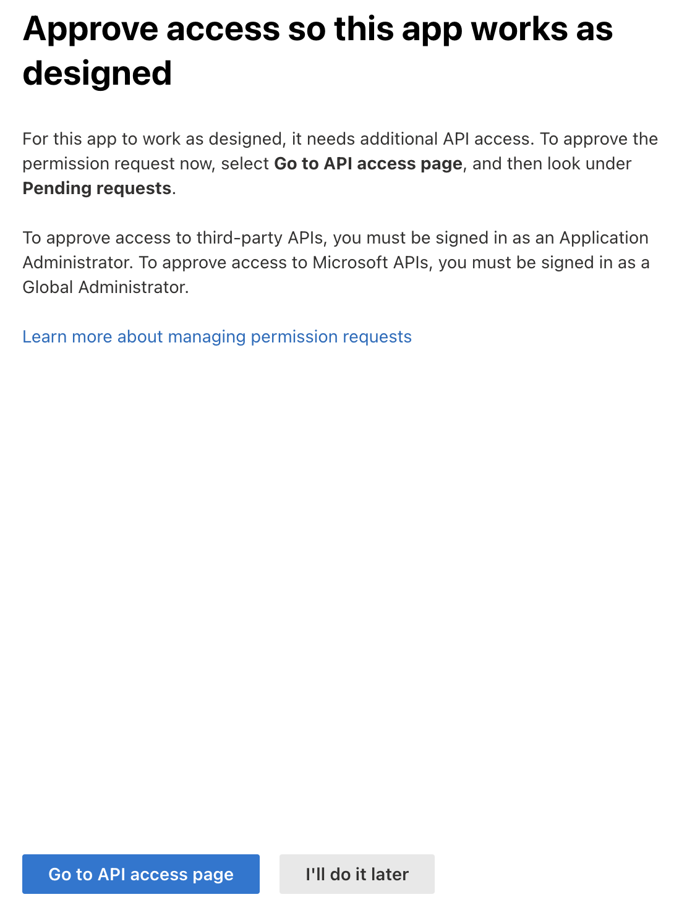

# Pages API Web Part

## Summary

Sample Web Part demonstrating how to leverage Pages API to list and filter all available pages from within a SharePoint Framework solution.

## Used SharePoint Framework Version 

## Applies to

* [SharePoint Framework](https://dev.office.com/sharepoint)
* [Office 365 tenant](https://dev.office.com/sharepoint/docs/spfx/set-up-your-development-environment)

## Solution

Solution|Author(s)
--------|---------
PagesAPIWebPart| [Hanbing Wang](https://github.com/sangle7)

## Version history

Version|Date|Comments
-------|----|--------
1.0|December 27, 2022|Initial release

## Disclaimer

**THIS CODE IS PROVIDED *AS IS* WITHOUT WARRANTY OF ANY KIND, EITHER EXPRESS OR IMPLIED, INCLUDING ANY IMPLIED WARRANTIES OF FITNESS FOR A PARTICULAR PURPOSE, MERCHANTABILITY, OR NON-INFRINGEMENT.**

---

## Minimal Path to Awesome

* Clone this repository
* Move to right solution folder
* in the command line run:
  * `npm install`
  * `gulp bundle --ship`
  * `gulp package-solution --ship`

This package produces the following:

* sharepoint/solution/pages-api-solution.sppkg - the package to install in the App Catalog of your target tenant

### Installation

1. From the **sharepoint/solution** folder, add the **pages-api-solution.sppkg** file to the tenant app catalog in your SharePoint tenant.

2. Grant API access, there should be a panel asking for API access:

3. Navigate to the API access page, approve the request for 'Microsoft Graph, Sites.Read.All'

4. Navigate to the site where you want to install the solution - it's using tenant-scoped deployment, so web part is automatically exposed in the web part picker just by adding it to the app catalog. Search for the Web Part with display name "PagesAPIWebPart".